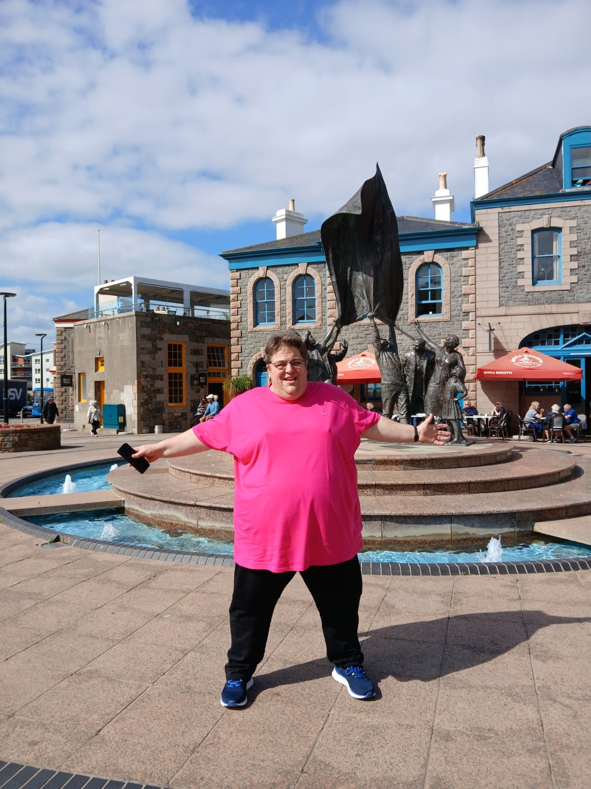
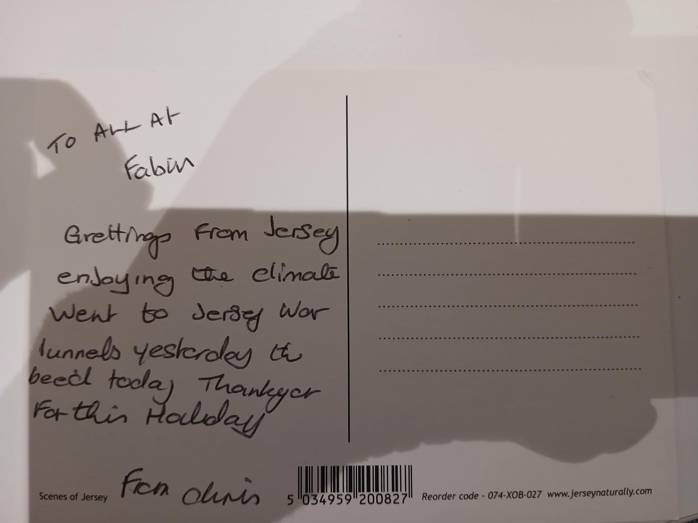
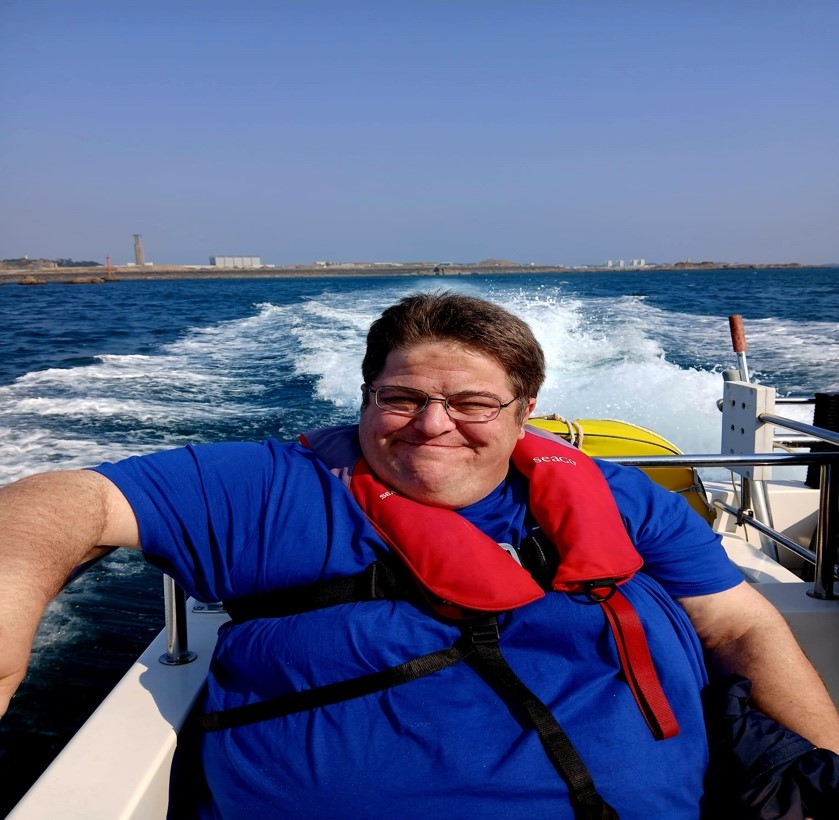

# Fabis sends it's first client on seven day holiday to Jersey

With only 6 months into its first operational year, the registered charity FABIS
(Friends of Acquired Brain Injury Survivors) has sent a member and his support worker
away on an all-expenses paid holiday to Jersey.

Since sustaining his ABI (Acquired Brain Injury) some 19 years ago, Chris has not
been able to afford a holiday. He needed a break as much as the rest of us- even more
so because of the way an ABI has changed his life. The pictures of Chris speak for
themselves as how much he enjoyed his holiday. But it was not only Chris who
benefitted from the holiday. It gave his family a much- needed break away from their
caring duties.

